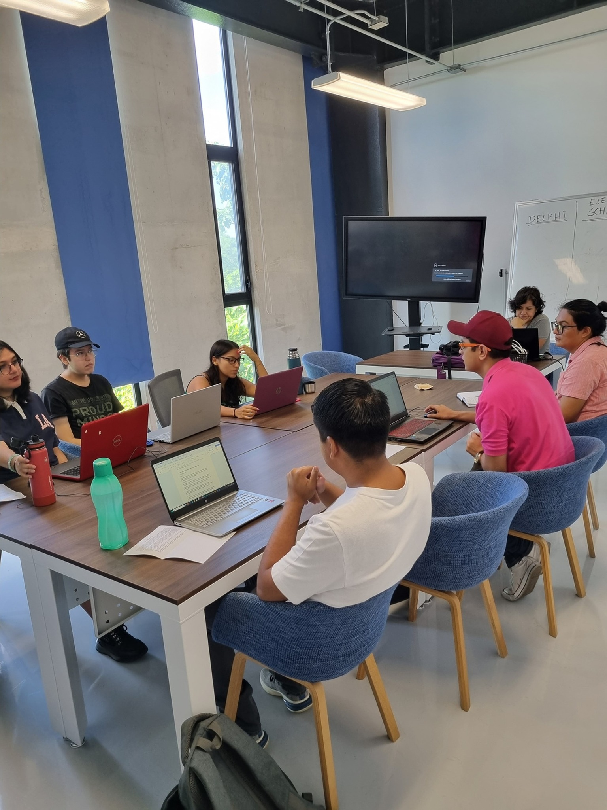

##### [**[Regresar al repositorio principal]**](https://github.com/ENES-Merida)
## ENES Mérida - Docencia
### Departamento de Matemáticas Aplicadas y Computación
> Repositorio de programas, escritos en varios lenguajes, que apoyan la labor docente en la Licenciatura en Ciencias de la Tierra.

## Asignaturas por semestre:
---
### Semestre 1
*proximamente*
### Semestre 2
*proximamente*
### Semestre 3
*proximamente*
### Semestre 4
*proximamente*
### Semestre 5
*proximamente*
### Semestre 6
*proximamente*
### Semestre 7
[Taller de Investigación en Ciencias Ambientales I](https://github.com/ENES-Merida/taller-de-investigacion-en-ciencias-ambientales-I?tab=readme-ov-file)
### Semestre 8
*proximamente*
### Semestre 9
*proximamente*
### Semestre 10
*proximamente*

    

### [**[Regresar al repositorio principal]**](https://github.com/ENES-Merida)
